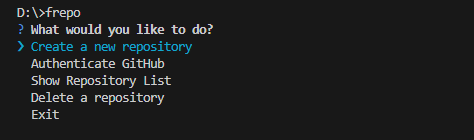
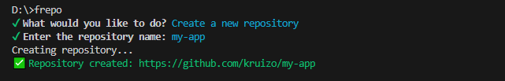
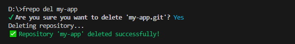
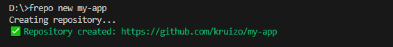

# Fast-REPO (frepo)

`frepo` is a command-line tool designed to help you manage your repositories efficiently, especially if you prefer to code a project first and then create a Git repository to save your work. This tool provides quick creation of an empty repository, deleting an empty repository, and listing your repositories without hassle.

## 📸 Screenshots

Here are some screenshots of `frepo`:









## Getting Started

Follow the steps below to set up and use `frepo`:

### Prerequisites

- Node.js (v14 or higher)
- npm (v6 or higher)

### Installation

1. **Clone the repository:**

   ```sh
   git clone https://github.com/kruizo/frepo.git
   cd frepo
   ```

2. **Install the dependencies:**

   ```sh
   npm install
   ```

3. **Link the package globally:**

   ```sh
   npm link
   ```

### Configuration

1. **Create a `.env` file:**

   Copy the `.env.example` file to `.env`:

   ```sh
   cp .env.example .env
   ```

2. **Set up OAuth App:**

   - Go to your OAuth provider (e.g., GitHub, Google).
   - Create a new OAuth application.
   - Obtain the `CLIENT_ID` and `CLIENT_SECRET`.

3. **Update the `.env` file:**

   Open the `.env` file and add your `CLIENT_ID` and `CLIENT_SECRET`:

   ```env
   CLIENT_ID=your_client_id
   CLIENT_SECRET=your_client_secret
   ```

4. **Authenticate:**

   After setting up the .env run the following command inside the frepo directory to authenticate to GITHUB:

   ```sh
   frepo auth
   ```

5. **FINISH!**

   You can now start using `frepo` to manage your repositories. Try using running

   ```sh
    frepo list
   ```

   to view your repositories.

### Commands

1. **Authenticate:**

   Run the following command to authenticate:

   ```sh
   frepo auth
   ```

2. **Create a new repository:**

   Use the following command to create a new repository:

   ```sh
   frepo new <reponame>
   ```

3. **Delete a repository:**

   Use the following command to delete a repository:

   ```sh
   frepo del <reponame>
   ```

4. **List all repositories:**

   Use the following command to list all repositories:

   ```sh
   frepo list
   ```

5. **Get help:**

   Use the following command to get help:

   ```sh
   frepo --help
   ```

6. **Force delete a repository:**

   Use the following command to force delete a repository:

   ```sh
   frepo del <reponame> -y
   ```

7. **Logout:**

   Use the following command to logout:

   ```sh
   frepo logout
   ```

## Contributing

Feel free to submit issues and pull requests. For major changes, please open an issue first to discuss what you would like to change.
